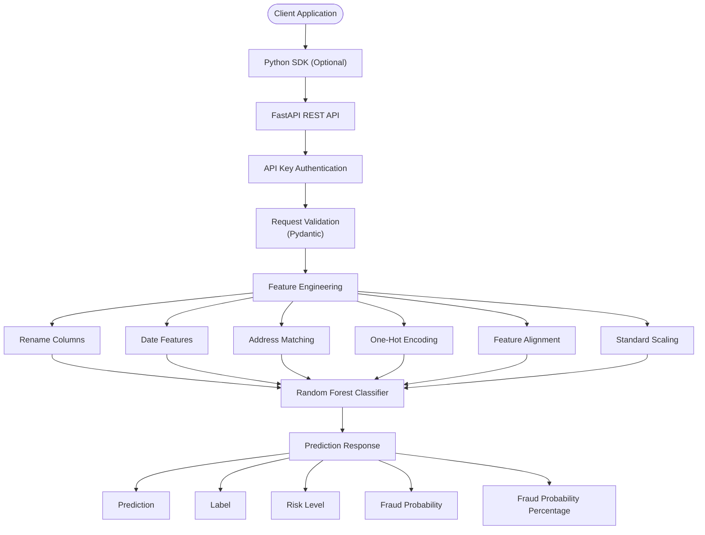

# 🛡️ Order Risk Platform API


A production-style Machine Learning REST API that predicts the fraud risk of e-commerce transactions using a trained **Random Forest Classifier**.

The project demonstrates the complete lifecycle of an ML application—from data preprocessing and feature engineering to model training, API development, authentication, validation, and documentation using **FastAPI**.

---

## Table of Contents

- Project Overview
- Features
- Architecture
- Tech Stack
- Project Structure
- Installation
- Environment Variables
- Running the API
- Authentication
- API Endpoints
- Feature Engineering
- Python SDK
- Testing
- Demo
- Example Workflow
- Future Improvements
- Learning Outcomes
- Author

## 📌 Project Overview

Traditional fraud detection systems rely on manually written business rules that are difficult to maintain and often fail to detect complex fraud patterns.

This project replaces static rule-based scoring with a Machine Learning model trained to identify potentially fraudulent transactions based on customer behavior, transaction details, and engineered features.

The API accepts an order, validates the request, performs the same preprocessing used during model training, generates a fraud prediction, and returns the prediction along with the fraud probability.

---

## ✨ Features

✅ Fraud detection using Random Forest

✅ REST API with FastAPI

✅ Python SDK

✅ Batch prediction

✅ API Key authentication

✅ Pydantic validation

✅ Automatic OpenAPI documentation

✅ Reusable preprocessing pipeline

✅ Structured logging

✅ Installable Python package

---


## 🏗️ Architecture


## 🛠 Tech Stack

| Category              | Technology           |
|-----------------------|----------------------|
| Language              | Python 3.10+         |
| API Framework         | FastAPI              |
| Validation            | Pydantic             |
| Machine Learning      | Scikit-learn         |
| Data Processing       | Pandas               |
| Model Serialization   | Joblib               |
| Environment Variables | python-dotenv        |
| API Documentation     | Swagger UI / OpenAPI |
| Server                | Uvicorn              |

---

# 📂 Project Structure

The project is organized into modular components, separating the API, machine learning pipeline, SDK, rule engine, frontend, and tests for maintainability and scalability.

```text
order-risk-platform/
│
├── api/                          # API schemas, authentication, and dependencies
│   ├── __init__.py
│   ├── auth.py
│   ├── dependencies.py
│   └── schemas.py
│
├── app/                          # FastAPI application entry point
│   ├── __init__.py
│   └── app.py
│
├── core/                         # Shared configuration, enums, and logging
│   ├── __init__.py
│   ├── config.py
│   ├── enums.py
│   └── logger.py
│
├── data/                         # Dataset(s)
│
├── ml/                           # Machine learning inference pipeline
│   ├── predictor.py
│   └── preprocessing.py
│
├── models/                       # Trained model and preprocessing artifacts
│   ├── *.joblib
│   └── ...
│
├── notebooks/                    # EDA, experimentation, and model development
│   ├── fraud_detection.ipynb
│   └── test_saved_model.py
│
├── order_risk_sdk/               # Reusable Python SDK
│   ├── __init__.py
│   ├── client.py
│   ├── config.py
│   └── exceptions.py
│
├── risk_rule_engine/             # Rule-based risk scoring engine
│   ├── examples/
│   ├── json_samples/
│   ├── cli.py
│   ├── models.py
│   ├── rules.py
│   └── scorer.py
│
├── services/                     # Business logic layer
│   ├── __init__.py
│   └── scoring.py
│
├── storefront/                   # Web interface
│   ├── routes/
│   ├── services/
│   ├── static/
│   ├── templates/
│   ├── app.py
│   └── config.py
│
├── tests/                        # Unit and integration tests
│   ├── conftest.py
│   ├── sample_data.py
│   ├── test_batch.py
│   ├── test_batch_sdk.py
│   ├── test_score.py
│   ├── test_sdk.py
│   └── test_sdk_import.py
│
├── .env                          # Environment variables (local)
├── .gitignore
├── pyproject.toml
├── pytest.ini
└── README.md
```

# 🚀 Installation

Clone the repository

```bash
git clone https://github.com/Bhav-creator452/order-risk-platform.git
cd order-risk-platform
```

Create a virtual environment

```bash
python -m venv .venv
```

Activate it

### Windows

```bash
.venv\Scripts\activate
```

### Linux / macOS

```bash
source .venv/bin/activate
```

---

# ⚙️ Environment Variables

Create a `.env` file in the project root.

```text
API_KEY=your_secure_api_key

MODEL_PATH=models/Random_Forest_model.joblib
FEATURE_NAMES_PATH=models/feature_names.joblib
SCALER_PATH=models/scaler.joblib

SDK_BASE_URL=http://127.0.0.1:8000
```

---
# 🚀 Running the Application

## ▶ Running the API

```bash
uvicorn app.app:app --reload
```

API

```
http://127.0.0.1:8000
```

Swagger Documentation

```
http://127.0.0.1:8000/docs
```

ReDoc

```
http://127.0.0.1:8000/redoc
```

## 🌐 Running the Storefront

The project includes a web-based storefront that allows users to submit orders through a graphical interface instead of calling the API directly.

### Step 1: Start the FastAPI backend

```bash
uvicorn app.app:app --reload
```

The API will be available at:

```
http://127.0.0.1:8000
```

### Step 2: Start the Storefront

Open a new terminal and run:

```bash
cd storefront
python app.py
```

The storefront will be available at:

```
http://127.0.0.1:5000
```

> **Note:** The FastAPI backend and the storefront must be running simultaneously. The storefront communicates with the API to perform fraud risk predictions.

---

# 🔐 Authentication

The `/score` endpoint is protected using API Key authentication.

Include the following header in every request.

```
X-API-Key: YOUR_API_KEY
```

Requests without a valid API key return

```
401 Unauthorized
```

---

# 📌 API Endpoints

## GET /

Returns basic information about the API.

Response

```json
{
  "message": "Order Risk Platform API"
}
```

---

## GET /health

Checks whether the API is running.

Response

```json
{
  "status": "healthy"
}
```

---

## POST /score

Predicts the fraud risk of an incoming order.

### Sample Request

```json
{
  "transaction_amount": 1499.99,
  "quantity": 2,
  "customer_age": 28,
  "account_age_days": 365,
  "transaction_hour": 14,
  "transaction_date": "2025-06-20",
  "payment_method": "credit card",
  "product_category": "electronics",
  "device_used": "mobile",
  "shipping_address": "Delhi",
  "billing_address": "Delhi"
}
```

### Sample Response

```json
{
  "prediction": 0,
  "label": "Legitimate",
  "risk_level": "LOW",
  "fraud_probability": 0.0842,
  "confidence": "8.42%"
}
```
### Example Single Prediction


## POST /score/batch

Predicts fraud risk for multiple orders in a single request.

### Sample Request

```json
{
  "orders": [
    {
      "transaction_amount": 250,
      "quantity": 1,
      "customer_age": 42,
      "account_age_days": 900,
      "transaction_hour": 14,
      "transaction_date": "2025-06-20T15:20:04",
      "payment_method": "credit card",
      "product_category": "electronics",
      "device_used": "desktop",
      "shipping_address": "Delhi",
      "billing_address": "Delhi"
    }
  ]
}
```

### Sample Response

```json
{
  "results": [
    {
      "prediction": 0,
      "label": "Legitimate",
      "risk_level": "LOW",
      "fraud_probability": 0.1397,
      "confidence": "13.97%"
    }
  ]
}
```
### Example Batch Prediction


---

# ✅ Request Validation

Incoming requests are automatically validated using Pydantic.

Examples of validations include:

- Required fields
- Numeric ranges
- Enum validation
- Data types
- Date format validation

Invalid requests return

```
422 Unprocessable Entity
```

---

# 📊 Feature Engineering

Before reaching the model, each request undergoes the same preprocessing used during model training.

The preprocessing pipeline performs:

- Column renaming
- Date feature extraction
- Address matching
- Account age grouping
- One-Hot Encoding
- Feature alignment
- Standardization

This guarantees inference consistency between training and production.

---

## 🤖 Machine Learning Model

The fraud detection model is based on a **Random Forest Classifier** trained on historical e-commerce transaction data.

### Training Pipeline

- Data Cleaning
- Exploratory Data Analysis (EDA)
- Feature Engineering
- Train/Test Split
- Baseline Logistic Regression
- Random Forest Training
- Hyperparameter Tuning (GridSearchCV)
- Model Serialization using Joblib

### Evaluation Metrics

- Accuracy
- Precision
- Recall
- F1 Score
- ROC-AUC

The trained model and preprocessing artifacts are stored in the `models/` directory and loaded automatically during inference.

## 📦 Python SDK

Install the SDK in editable mode:

```bash
pip install -e .
```

Create a client:

```python
from order_risk_sdk import OrderRiskClient

client = OrderRiskClient(
    base_url="http://127.0.0.1:8000",
    api_key="YOUR_API_KEY",
)
```

### Score a single order

```python
result = client.score_order(order)

print(result)
```

### Score multiple orders

```python
results = client.batch_score(
    [
        order1,
        order2,
    ]
)

print(results)
```

The SDK automatically:

- Handles authentication
- Sends HTTP requests
- Parses JSON responses
- Raises `APIError` for request failures

# 🧪 Testing

The API has been manually tested for the following scenarios.

| Component               | Status   |
| ----------------------- | :----:   |
| Health endpoint         |    ✅   |
| `/score` endpoint       |    ✅   |
| `/score/batch` endpoint |    ✅   |
| API authentication      |    ✅   |
| Request validation      |    ✅   |
| SDK `score_order()`     |    ✅   |
| SDK `batch_score()`     |    ✅   |
| Editable installation   |    ✅   |
| External import         |    ✅   |

---

# 🎬 Demo

The complete application consists of both the FastAPI backend and the web storefront.

Demo workflow:

1. Start the FastAPI server.
2. Launch the storefront application.
3. Open the storefront in a browser.
4. Fill in an order form.
5. Submit the order.
6. The storefront sends the request to the FastAPI API.
7. The API validates the request, preprocesses the features, performs model inference, and returns the fraud prediction.
8. The prediction is displayed on the storefront.

The API was tested using representative low-, medium-, and high-risk orders to demonstrate different fraud risk levels.


# 📈 Example Workflow

```
User
   │
   ▼
Storefront (Web UI)
   │
   ▼
FastAPI REST API
   │
   ▼
API Key Authentication
   │
   ▼
Request Validation
   │
   ▼
Feature Engineering
   │
   ▼
Random Forest Model
   │
   ▼
Prediction Response
   │
   ▼
Displayed in Storefront
```

---

# 🔮 Future Improvements

- Docker containerization

- GitHub Actions CI/CD

- Cloud deployment (AWS/Azure/GCP)

- Rate limiting

- JWT authentication

- Model versioning

- Database integration

- Monitoring and metrics

- Request tracing

- Caching
---

## 📚 Learning Outcomes

Through this project I learned how to build an end-to-end machine learning application that is suitable for production-style deployment.

Key takeaways include:

- Designing modular Python applications.
- Building REST APIs using FastAPI.
- Packaging reusable Python SDKs.
- Implementing consistent preprocessing pipelines.
- Evaluating classification models using Precision, Recall, F1-score, and ROC-AUC.
- Deploying trained models using Joblib.
- Securing APIs with API key authentication.
- Writing maintainable, testable code using Pytest.
- Integrating machine learning into a complete software application.


# 👩‍💻 Author

**Bhavdeep Kaur**

BCA Student | Aspiring Data Scientist / Machine Learning Engineer

GitHub: https://github.com/Bhav-creator452

LinkedIn: https://linkedin.com/in/bhavdeep-kaur2006

## 🙏 Acknowledgements

This project was developed as part of a structured software engineering and machine learning learning journey. It combines concepts from data science, backend development, API design, testing, and software architecture into a single end-to-end application.