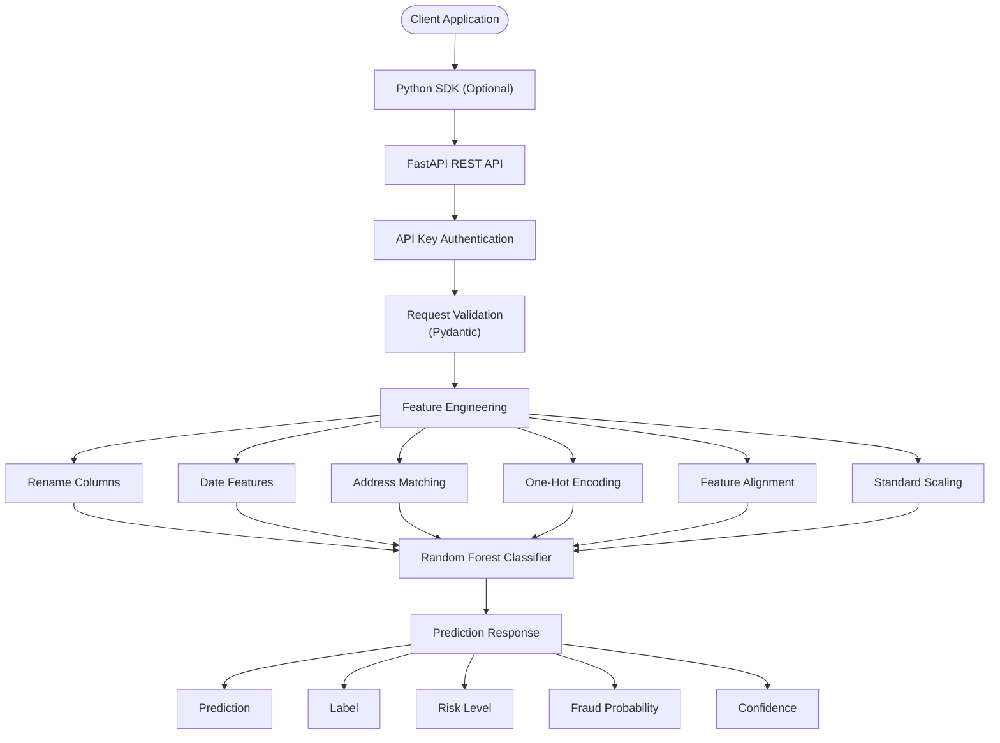
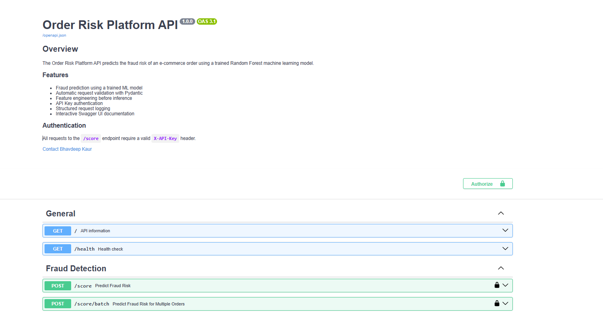
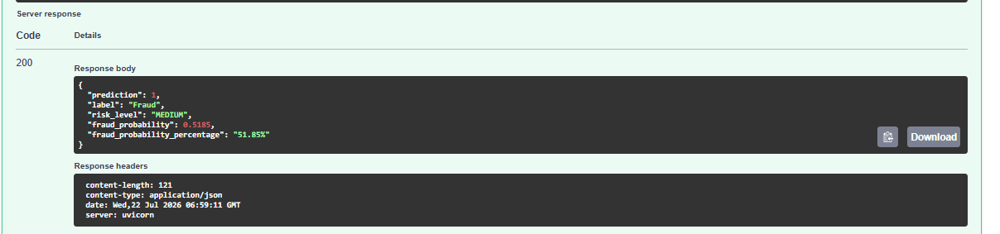
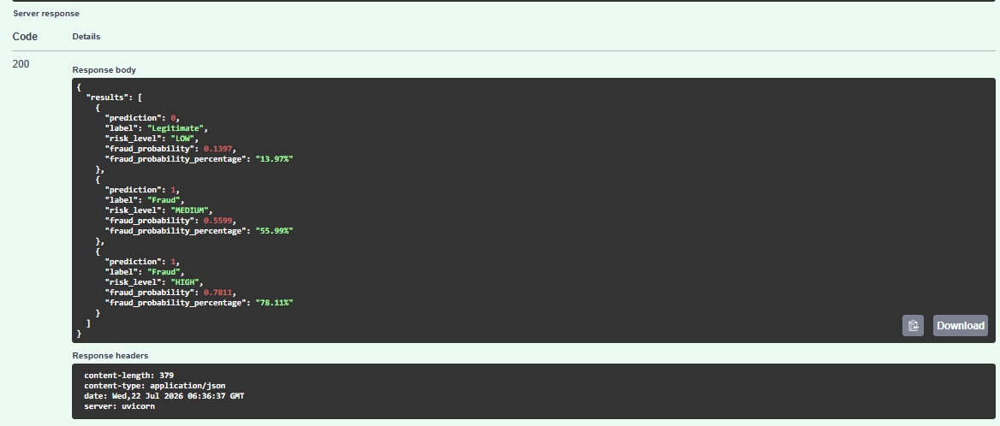

# 🛡️ Order Risk Platform API

A production-style Machine Learning REST API that predicts the fraud risk of e-commerce transactions using a trained **Random Forest Classifier**.

The project demonstrates the complete lifecycle of an ML application—from data preprocessing and feature engineering to model training, API development, authentication, validation, and documentation using **FastAPI**.

---

## 📌 Project Overview

Traditional fraud detection systems rely on manually written business rules that are difficult to maintain and often fail to detect complex fraud patterns.

This project replaces static rule-based scoring with a Machine Learning model trained to identify potentially fraudulent transactions based on customer behavior, transaction details, and engineered features.

The API accepts an order, validates the request, performs the same preprocessing used during model training, generates a fraud prediction, and returns the prediction along with the fraud probability.

---

## ✨ Features

✅ Fraud detection using Random Forest

✅ REST API with FastAPI

✅ Python SDK

✅ Batch prediction

✅ API Key authentication

✅ Pydantic validation

✅ Automatic OpenAPI documentation

✅ Reusable preprocessing pipeline

✅ Structured logging

✅ Installable Python package

---


## 🏗️ Architecture


## 🛠 Tech Stack

| Category              | Technology           |
|-----------------------|----------------------|
| Language              | Python 3.10+         |
| API Framework         | FastAPI              |
| Validation            | Pydantic             |
| Machine Learning      | Scikit-learn         |
| Data Processing       | Pandas               |
| Model Serialization   | Joblib               |
| Environment Variables | python-dotenv        |
| API Documentation     | Swagger UI / OpenAPI |
| Server                | Uvicorn              |

---

# 📂 Project Structure

```
The repository is organized into modular components, separating the API, machine learning pipeline, Python SDK, and rule-based engine for maintainability and scalability.


order-risk-platform/
│
├── app/
│   ├── __init__.py
│   ├── app.py                  # FastAPI application entry point
│   │
│   ├── api/
│   │   ├── __init__.py
│   │   ├── auth.py             # API key authentication
│   │   ├── dependencies.py     # FastAPI dependencies
│   │   └── schemas.py          # Request and response models
│   │
│   ├── core/
│   │   ├── __init__.py
│   │   ├── config.py           # Configuration and environment settings
│   │   ├── enums.py            # Shared enumerations
│   │   └── logger.py           # Logging configuration
│   │
│   └── ml/
│       ├── __init__.py
│       ├── predictor.py        # Model inference
│       ├── preprocessing.py    # Feature engineering pipeline
│       └── model_loader.py     # Model loading utilities (or model_check.py if unchanged)
│
├── order_risk_sdk/
│   ├── __init__.py
│   ├── client.py               # SDK client
│   ├── config.py               # SDK configuration
│   └── exceptions.py           # Custom SDK exceptions
│
├── rule_engine/
│   ├── __init__.py
│   ├── cli.py                  # Rule engine CLI
│   ├── models.py               # Customer & Order dataclasses
│   ├── rules.py                # Business rules
│   ├── scorer.py               # Risk scoring engine
│   │
│   ├── examples/
│   │   ├── model_check.py
│   │   └── scorer_check.py
│   │
│   └── json_samples/
│       ├── high_risk_order.json
│       ├── medium_risk_order.json
│       └── low_risk_order.json
│
├── services/                   # Business/service layer
├── models/                     # Trained ML model artifacts (.joblib)
├── tests/                      # Unit and SDK tests
├── notebooks/                  # EDA and experimentation
├── data/                       # Dataset(s)
│
├── README.md
├── pyproject.toml
└── .gitignore

---

# 🚀 Installation

Clone the repository

```bash
git clone https://github.com/Bhav-creator452/order-risk-platform.git
cd order-risk-platform
```

Create a virtual environment

```bash
python -m venv .venv
```

Activate it

### Windows

```bash
.venv\Scripts\activate
```

### Linux / macOS

```bash
source .venv/bin/activate
```

---

# ⚙ Environment Variables

Create a `.env` file in the project root.

Example

```text
API_KEY=your_secure_api_key

MODEL_PATH=models/Random_Forest_model.joblib

FEATURE_NAMES_PATH=models/feature_names.joblib

SCALER_PATH=models/scaler.joblib
```

---

# ▶ Running the API

```bash
uvicorn app.app:app --reload
```

API

```
http://127.0.0.1:8000
```

Swagger Documentation

```
http://127.0.0.1:8000/docs
```

ReDoc

```
http://127.0.0.1:8000/redoc
```

---

# 🔐 Authentication

The `/score` endpoint is protected using API Key authentication.

Include the following header in every request.

```
X-API-Key: YOUR_API_KEY
```

Requests without a valid API key return

```
401 Unauthorized
```

---

# 📌 API Endpoints

## GET /

Returns basic information about the API.

Response

```json
{
  "message": "Order Risk Platform API"
}
```

---

## GET /health

Checks whether the API is running.

Response

```json
{
  "status": "healthy"
}
```

---

## POST /score

Predicts the fraud risk of an incoming order.

### Sample Request

```json
{
  "transaction_amount": 1499.99,
  "quantity": 2,
  "customer_age": 28,
  "account_age_days": 365,
  "transaction_hour": 14,
  "transaction_date": "2025-06-20",
  "payment_method": "credit card",
  "product_category": "electronics",
  "device_used": "mobile",
  "shipping_address": "Delhi",
  "billing_address": "Delhi"
}
```

### Sample Response

```json
{
  "prediction": 0,
  "label": "Legitimate",
  "risk_level": "LOW",
  "fraud_probability": 0.0842,
  "confidence": "8.42%"
}
```
### Example Single Prediction



## POST /score/batch

Predicts fraud risk for multiple orders in a single request.

### Sample Request

```json
{
  "orders": [
    {
      "transaction_amount": 250,
      "quantity": 1,
      "customer_age": 42,
      "account_age_days": 900,
      "transaction_hour": 14,
      "transaction_date": "2025-06-20T15:20:04",
      "payment_method": "credit card",
      "product_category": "electronics",
      "device_used": "desktop",
      "shipping_address": "Delhi",
      "billing_address": "Delhi"
    }
  ]
}
```

### Sample Response

```json
{
  "results": [
    {
      "prediction": 0,
      "label": "Legitimate",
      "risk_level": "LOW",
      "fraud_probability": 0.1397,
      "confidence": "13.97%"
    }
  ]
}
```
### Example Batch Prediction


---

# ✅ Request Validation

Incoming requests are automatically validated using Pydantic.

Examples of validations include:

- Required fields
- Numeric ranges
- Enum validation
- Data types
- Date format validation

Invalid requests return

```
422 Unprocessable Entity
```

---

# 📊 Feature Engineering

Before reaching the model, each request undergoes the same preprocessing used during model training.

The preprocessing pipeline performs:

- Column renaming
- Date feature extraction
- Address matching
- Account age grouping
- One-Hot Encoding
- Feature alignment
- Standardization

This guarantees inference consistency between training and production.

---

## 📦 Python SDK

Install the SDK in editable mode:

```bash
pip install -e .
```

Create a client:

```python
from order_risk_sdk import OrderRiskClient

client = OrderRiskClient(
    base_url="http://127.0.0.1:8000",
    api_key="YOUR_API_KEY",
)
```

### Score a single order

```python
result = client.score_order(order)

print(result)
```

### Score multiple orders

```python
results = client.batch_score(
    [
        order1,
        order2,
    ]
)

print(results)
```

The SDK automatically:

- Handles authentication
- Sends HTTP requests
- Parses JSON responses
- Raises `APIError` for request failures

# 🧪 Testing

The API has been manually tested for the following scenarios.

| Component               | Status   |
| ----------------------- | :----:   |
| Health endpoint         |    ✅   |
| `/score` endpoint       |    ✅   |
| `/score/batch` endpoint |    ✅   |
| API authentication      |    ✅   |
| Request validation      |    ✅   |
| SDK `score_order()`     |    ✅   |
| SDK `batch_score()`     |    ✅   |
| Editable installation   |    ✅   |
| External import         |    ✅   |

---

# 🎬 Demo

The API has been tested using three representative orders to demonstrate different fraud risk levels.

| Order       | Prediction | Risk Level | Fraud Probability |
|-------------|------------|------------|------------------:|
| Low Risk    | Legitimate | LOW        | 13.97%            |
| Medium Risk | Fraud      | MEDIUM     | 55.99%            |
| High Risk   | Fraud      | HIGH       | 78.11%            |

These examples demonstrate how the API differentiates between varying levels of fraud risk.

# 📈 Example Workflow

```
Client
   │
POST /score
   │
   ▼
API Key Authentication
   │
   ▼
Request Validation
   │
   ▼
Feature Engineering
   │
   ▼
Random Forest Prediction
   │
   ▼
JSON Response
```

---

# 🔮 Future Improvements

- Possible enhancements include:

- Docker containerization

- GitHub Actions CI/CD

- Cloud deployment (AWS/Azure/GCP)

- Rate limiting

- JWT authentication

- Model versioning

- Database integration

- Monitoring and metrics

- Request tracing

- Caching
---

# 📚 Learning Outcomes

This project demonstrates practical experience with:

- Machine Learning model deployment
- REST API development
- FastAPI
- Feature engineering
- Model serialization
- Request validation
- Authentication
- Error handling
- Environment configuration
- API documentation

---


# 👩‍💻 Author

**Bhavdeep Kaur**

BCA Student | Aspiring Data Scientist / Machine Learning Engineer

GitHub: https://github.com/Bhav-creator452

LinkedIn: https://linkedin.com/in/bhavdeep-kaur2006